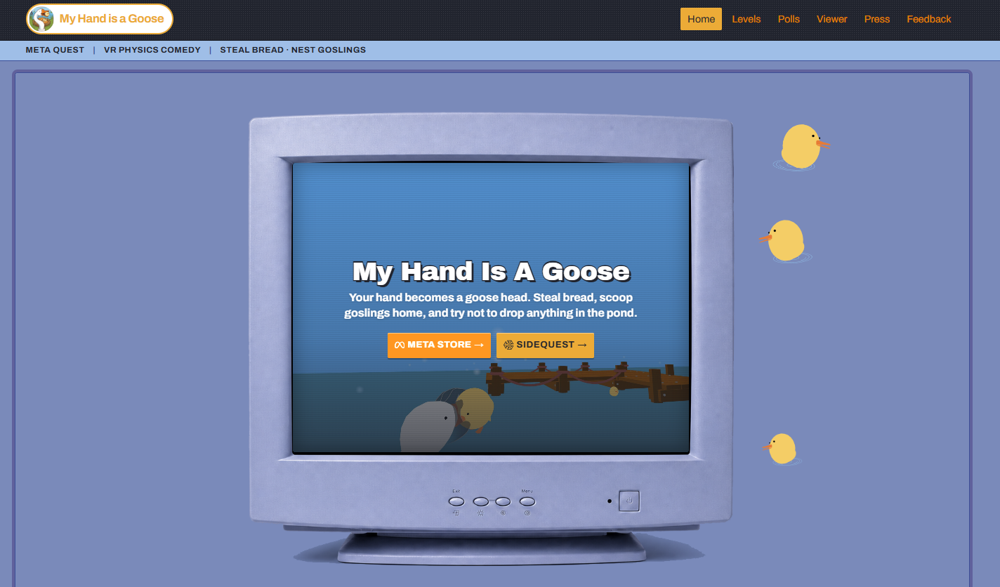
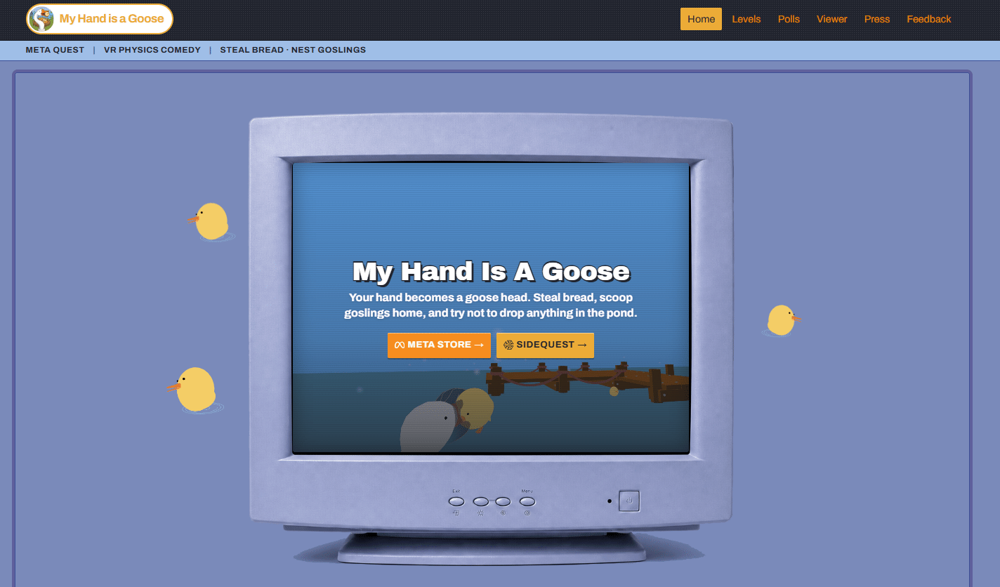
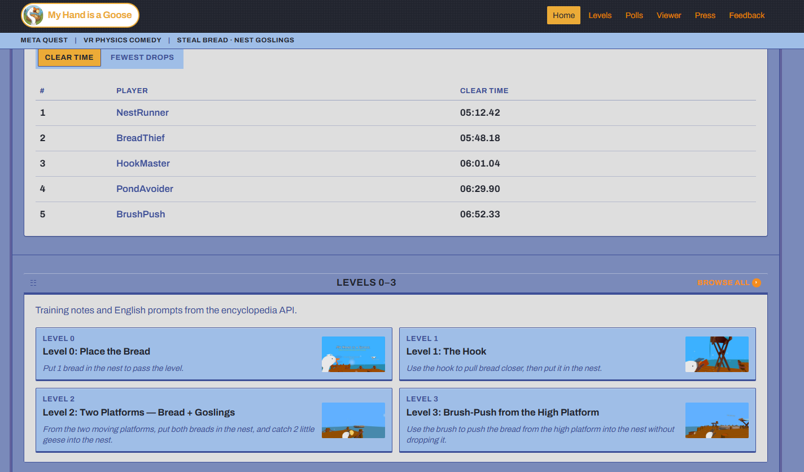
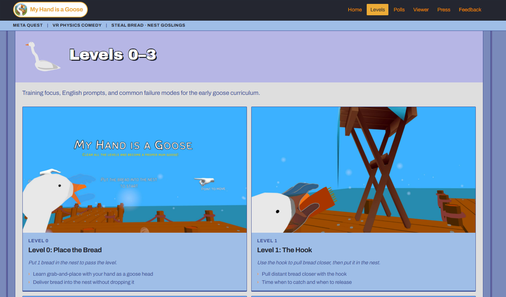
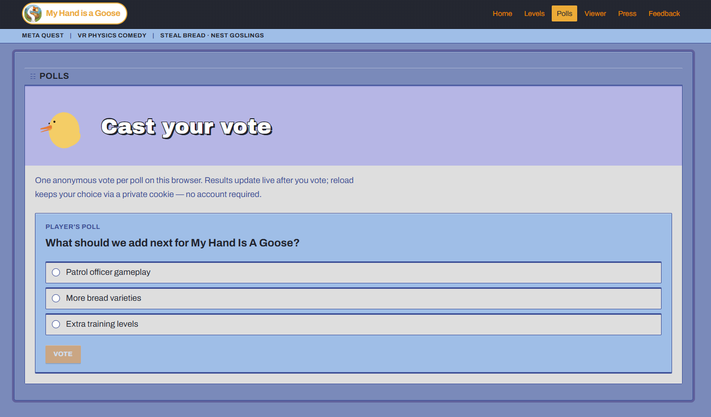
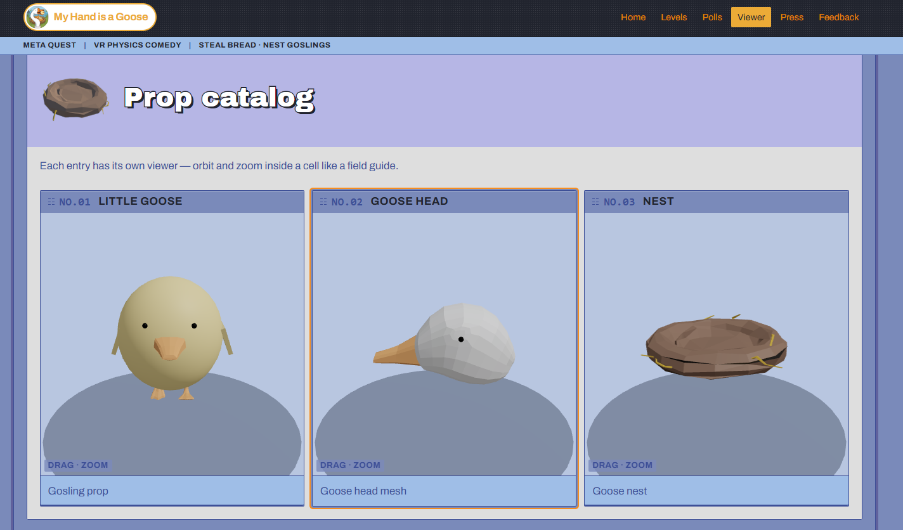
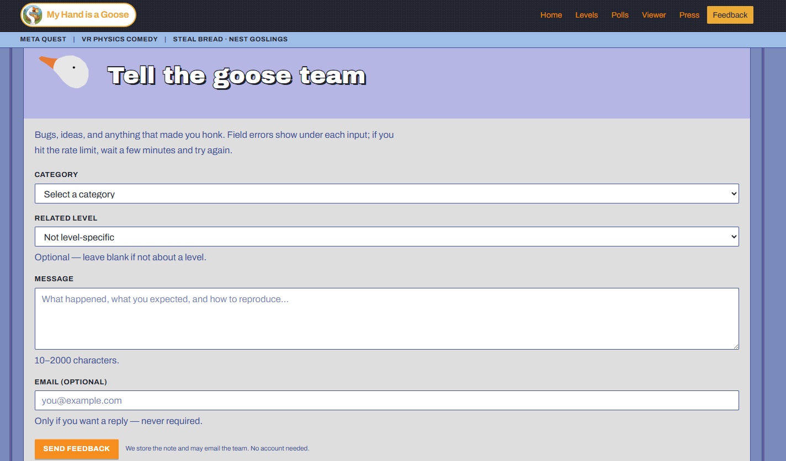
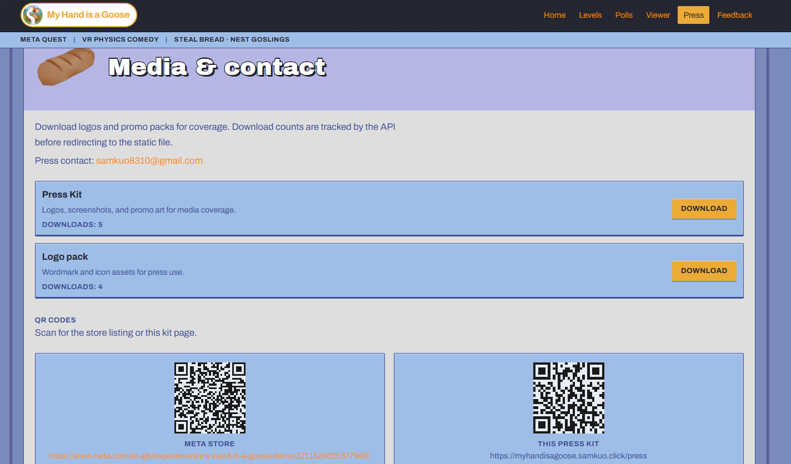

# My Hand Is A Goose — Official Website

Official site for the VR game **My Hand Is A Goose**: game intro, level guides, community feedback & polls, and Meta Store discovery.

**Website:** [https://myhandisagoose.samkuo.click/](https://myhandisagoose.samkuo.click/)  
**CloudFront（backup）:** [https://d3vlpanqbcn6jb.cloudfront.net/](https://d3vlpanqbcn6jb.cloudfront.net/)  
**Meta Store:** [My Hand is a Goose Demo](https://www.meta.com/en-gb/experiences/my-hand-is-a-goose-demo/1211524025377940/)

## Screenshots





| Page | Preview |
|------|---------|
| Home — leaderboard & levels |  |
| Levels |  |
| Polls |  |
| Viewer |  |
| Feedback |  |
| Press |  |

## Features

- **Landing** — Game pitch, Meta Store link / QR code, demo leaderboard
- **Level wiki** — Levels 0–3 guides (Markdown on the backend → API)
- **Feedback** — Form submissions to MongoDB, email alerts via Resend
- **Wishlist polls** — Anonymous voting with cookie / IP-hash anti-spam
- **Press kit** — Media downloads with download counters
- **3D viewer** — In-browser props viewer (react-three-fiber, frontend-only)

> Phase 1 does not receive any player data from the game client. The leaderboard uses demo / fake data.

## Architecture

| Layer | Stack | Deploy |
|-------|--------|--------|
| Frontend | Vite, React, TypeScript, Tailwind, shadcn/ui, TanStack Query, Zustand, R3F | S3 + CloudFront |
| Backend | Express, TypeScript, mongoose, zod, Resend | EC2 + nginx + pm2 |
| DB | MongoDB Atlas | — |
| CI/CD | GitHub Actions (lint / test / build → auto-deploy on `main`) | — |

```
web/frontend  →  HTTPS  →  web/backend (Express :3002)
     │                          │
     └─ S3 / CloudFront         └─ MongoDB Atlas / Resend
```

## Repository layout

```
├── web/
│   ├── frontend/          # Vite SPA
│   └── backend/           # Express API
├── source/                # Site screenshots & demo GIF for README
├── ops/                   # Manual deploy scripts, nginx, pm2, env examples
├── doc/                   # Specs, AWS, CI/CD runbook
└── .github/workflows/     # CI + frontend/backend deploy
```

## Local development

Requires **Node.js ≥ 20** and MongoDB (Atlas recommended).

### Backend

```bash
cd web/backend
cp .env.example .env   # set MONGO_URI, Resend, vote secret, etc.
npm ci
npm run dev            # http://localhost:3002
```

Optional: `npm run seed:polls` to seed poll topics.

### Frontend

```bash
cd web/frontend
cp .env.example .env   # VITE_API_BASE_URL=http://localhost:3002
npm ci
npm run dev            # http://localhost:5173
```

### Common scripts

Available in both packages:

| Script | Description |
|--------|-------------|
| `npm run lint` | ESLint |
| `npm run typecheck` | TypeScript |
| `npm run test` | Vitest |
| `npm run build` | Production build |

## Main routes

| Path | Description |
|------|-------------|
| `/` | Home |
| `/levels`, `/levels/:levelId` | Level list / detail |
| `/feedback` | Feedback form |
| `/polls` | Polls |
| `/press` | Press kit |
| `/viewer` | 3D object viewer |

## Docs

| Doc | Contents |
|-----|----------|
| [`doc/web_plan.md`](doc/web_plan.md) | Product & architecture overview |
| [`doc/web_frontend_react.md`](doc/web_frontend_react.md) | Frontend spec |
| [`doc/web_backend_express.md`](doc/web_backend_express.md) | Backend spec |
| [`doc/Nintendodesign.md`](doc/Nintendodesign.md) | UI visual guidelines |
| [`doc/aws-manual-deploy.md`](doc/aws-manual-deploy.md) | Manual deploy |
| [`doc/ci-cd-runbook.md`](doc/ci-cd-runbook.md) | GitHub Actions → AWS |
| [`ops/README.md`](ops/README.md) | Deploy scripts |

## License

Private — do not redistribute without permission.
